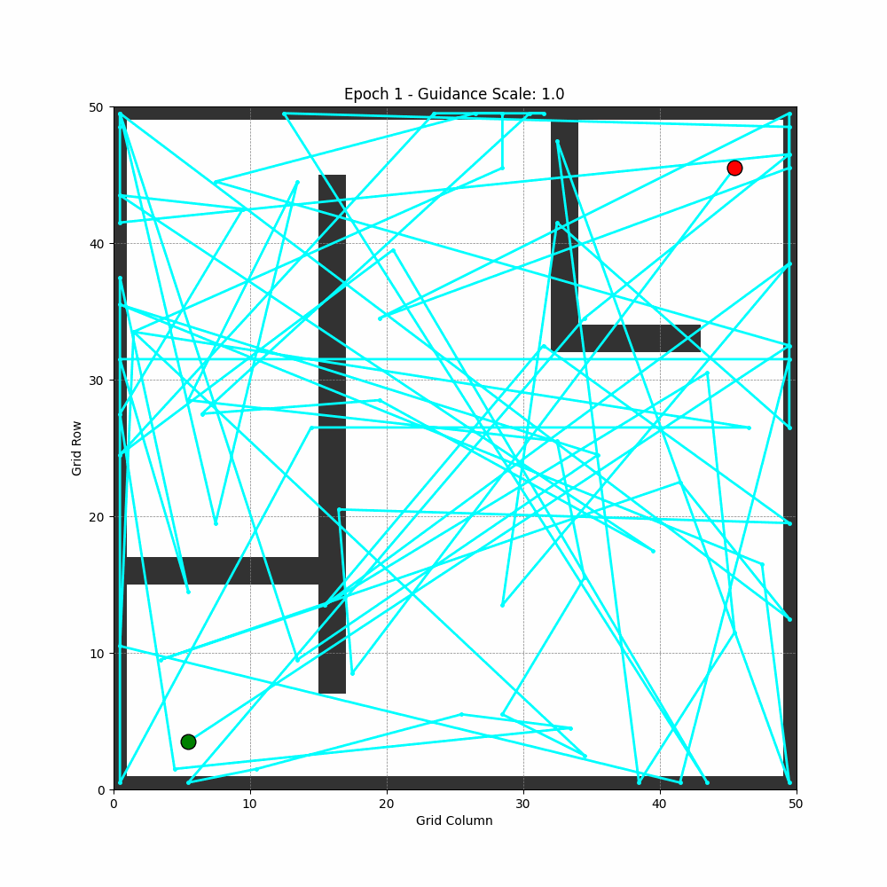

# Diffusion-Based Path Planning

This project implements a Denoising Diffusion Probabilistic Model (DDPM) to learn a prior distribution over smooth, collision-free robot trajectories from expert demonstrations. The system consists of three main components: expert trajectory generation, model training, and inference.

## 1. Expert Trajectory Generation

The `generate_trajectories.py` script creates a dataset of expert trajectories using A* search algorithm on a grid-based map with obstacles. These trajectories serve as the ground truth for training the diffusion model.

Key features:
- Creates a binary obstacle map with walls and barriers
- Generates start and goal points in free spaces
- Uses A* search to find optimal paths
- Normalizes and processes trajectories to a consistent format
- Saves the dataset with trajectories and their conditions (start, goal, obstacle map)

<!--  -->


## 2. Model Training

The `train_diffusion_policy_refined_cfg.py` script implements the diffusion model training pipeline. 

Key components:
- `TrajectoryDataset` class loads the expert trajectories and their conditions
- Implements a conditional UNet architecture that takes trajectory state, time embedding, and environmental conditions
- Trains the model to denoise random Gaussian noise into expert trajectories
- Uses classifier-free guidance (CFG) for improved conditioning
- Saves model checkpoints during training

## 3. Inference

The `inference_diffusion_policy_refined_cfg.py` script loads a trained model and generates new trajectories for specified start, goal, and obstacle configurations.

Key features:
- Loads trained model checkpoints
- Implements the reverse diffusion process with classifier-free guidance
- Generates smooth, collision-free trajectories between any valid start and goal
- Visualizes the results with the obstacle map

<!--  -->


The model also shows impressive generalization to new scenarios not seen during training:

<!--  -->


## 4. Denoising Process Visualization

The diffusion model works by gradually denoising a random Gaussian noise distribution into a coherent trajectory. The following visualization shows this process:

<!--  -->


This visualization shows several key steps in the denoising process:
1. Initially, the trajectory is pure Gaussian noise
2. As denoising progresses, the trajectory gradually takes shape
3. The model first establishes the general path direction
4. Later steps refine the trajectory to be smooth and avoid obstacles
5. The final result is a collision-free path connecting start and goal

The model enforces the constraints at both endpoints (start and goal positions) throughout the entire denoising process while learning to navigate around obstacles.

## Model Files

The trained model files exceed GitHub's file size limits and are not included in this repository. To use this project:

1. Download the model files from [this Google Drive folder](https://drive.google.com/drive/folders/1TqqesEUCl98pXbLvBY5s6jEBNImMX1mc?usp=sharing)
2. Place it in the following repository:
   - `./diffusion_policy_unet_refined_cfg.pth`


## Requirements
- PyTorch
- NumPy
- Matplotlib
- Pickle

## Usage

1. Generate expert trajectories:
```
python generate_trajectories.py
```

2. Train the diffusion model:
```
python train_diffusion_policy_refined_cfg.py
```

3. Run inference with a trained model:
```
python inference_diffusion_policy_refined_cfg.py
```


## Citation

If you find this work useful in your work or research, please consider citing:

```bibtex
@software{ghimire2025diffusion,
  author = {Ghimire, Donipolo},
  title = {Diffusion-Based Path Planning},
  year = {2025},
  url = {https://github.com/donipologhimire/diffusion_based_planning},
  version = {1.0.0}
}